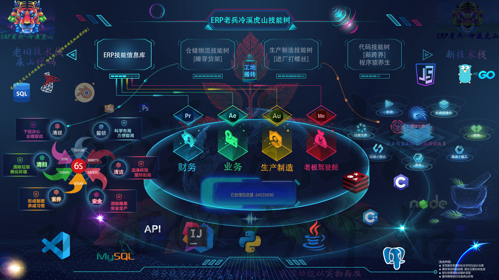
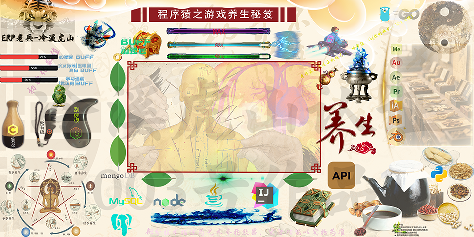

## 🔧 关于这个"不守行规"的叛徒  
> "流水线叛逃者 | 仓库老炮儿の代码代言人 | 财务部御用外挂  
> 现在正试图用Python教会老师傅们什么叫做『数字化骂街』"

🎯 人设暴击三连

🔥 【赛博车间の三重幻影】

🚀 我是谁？
流水线の螺丝暴徒 → ERP系统の老江湖 → 仓库老炮儿の代码代理人 → 现在专治各种不服的全栈狠人

用 车间级仓库老炮儿业务理解 暴打学院派理论

把 财务小姐姐的骂娘需求 变成优雅代码

在 仓库老哥的脏话日志 里提炼真实业务逻辑

[点击查看技能树图片](./erp_skill_tree.png) | [点击查看养生海报](./programmer_health_poster.png)

  

  
    

  

  
    
    

  

> **“左手《SQL性能优化》，右手《黄帝内经》，  
> 在硅基和碳基之间反复横跳的赛博方士。”** 

## 🤖 关于这个"不务正业"的赛博工人  
> "初中毕业→生产线→ERP实施→全栈开发→现在还想用AI重构祖传MES系统  
> 这要么是励志故事，要么是职场恐怖片——取决于你是HR还是技术总监"

**初中学历非科班突围路线**  
从生产线走向全栈开发的实战派，通过：
- 10年ERP系统实施（服务100+客户，覆盖20+行业）
- 5年医疗仓储物流数字化管理经验
- 2年生产制造打螺丝一线经验
- 没有证书加持,求职过程极其艰难,超地狱难度路线,全靠工作实战经验堆叠
- 看到别人写的屎山太多,不如自己从头零开始学编程,持续探索ERP+中医+编程的多领域跨界融合
> "学历是入场券，但解决问题的能力才是永恒通行证"

## 🏭 从流水线到中医流全栈の野路子战神  
**核心优势**：  
- 用 `企业级业务逻辑` 暴打 `学院派理论`  
- 擅长把 `ERP/WMS/MES` 的屎山变成 `Python/Go/Spring全家桶`  
- 副业：用药材疗法治疗 `NullPointerException`  

## 🦾 您的一线业务逻辑外挂已上线  
**服务对象**：  
- 被用友金蝶SAP折磨到秃头的 `财务小姐姐`  
- 想掐死ERP系统的 `仓库老哥`  
- 觉得MES都是智障设计的 `车间阿姨`  

> **“别问我为什么懂——  
> 我的代码里藏着流水线的机油味|货架味|财务室的咖啡香！”**

🎯 人设标签：

### 🛠️ 技术栈  
**编程语言**: Python, JavaScript, Go, Java, C/C++  
**云与运维**: Linux, Docker, Podman  
**前端**: Vue, React  
**后端**: Django, Spring Boot, Spring Cloud  
**数据库**: Redis, PostgreSQL, MySQL, SQL Server, Oracle  

## 🏗️ 技术定位  
**🩺 老系统维护专家**:  
- 用友 NC (Oracle) | 用友 老T系列 T+系列 U8 (SQL Server) | 数据库调优 & 数据迁移  
**🚀 现代技术主力**:  
  
**❌ 不接需求**:  
- 祖传代码激情二开（除非加钱加到感动我）  

> 💡 **“能帮您的旧系统平稳退役，也能用 Go/Spring Cloud 搭新架构——  
> 横跨 ERP 和云原生的缝合怪，欢迎来聊！”**  

### 🩺 作者背景补充：300味常用药「人肉审方」本能

- 虽未取得执业资格，ERP实施中但在**临床一线（社区诊所/大型综合医院）、中药材生产全流程**中积累的实战经验，构建了我的核心专业能力。

（临床高频300味+次要200味药材，无需查资料30秒定位不合理用药，精准纠错！）

#### 🧠 核心能力
| 维度         | 说明                                | 等级  |
|--------------|-----------------------------------|-------|
| **常用药掌控** | 300味高频药（如黄芪/当归）性味归经、配伍禁忌、剂量窗口烂熟于心 | ⭐⭐⭐⭐⭐ |
| **次用药雷达** | 200味次要药（如矮地茶）特效与风险秒级识别            | ⭐⭐⭐⭐  |
| **方剂直觉**   | 一眼看穿「君臣佐使」配伍漏洞（如麻黄配熟地闭门留寇）        | ⭐⭐⭐⭐⭐ |
| **纠错速度**   | 平均30秒纠正不合理用药（如甘草过量水肿/孕妇禁用活血药）     | ⭐⭐⭐⭐⭐ |

#### 🛠️ 修炼秘籍
- **三遍背药法**：按功效→归经→禁忌分类强化记忆
- **方剂拆解术**：拆解经典方模块化组件，理解底层配伍逻辑
- **临床反刍**：复盘名老中医医案，分析用药底层逻辑
- **现代交叉**：关联中医证型与现代医学指标

> "就像老程序员忘不了sudo rm -rf的恐惧——
  我永远记得十八反和十九畏的配伍雷区！"

> 🎯 目标：让方剂像代码一样安全有效，杜绝不合理用药！  
（三甲医院带教/执业医师考核双重验证）

### 🛡️ 作者身体BUFF一览：野生程序猿极客养生体质大公开

#### 💪 核心战斗属性
| 属性        | 数值/状态          | 极客养生解读                     | 您的羡慕指数 |
|-------------|--------------------|------------------------------|--------------|
| **年龄**    | 38岁（资深极客养生者） | 「气血充盈，经脉稳固」的黄金期 | ⭐⭐⭐⭐       |
| **编码耐力**| 日均10-12小时净编码 | 等同于「筑基期修士」的灵力续航 | ⭐⭐⭐⭐⭐      |
| **双眼状态**| 5.3视力（钛合金级） | 「肝血充盈，目明心亮」的养生巅峰 | ⭐⭐⭐⭐⭐      |
| **发际线**  | 逆生长（发量+）    | 「肾精旺盛，固本培元」的隐藏buff | ⭐⭐⭐⭐⭐⭐     |

#### 🧪 极客养生体质养成秘方
1. **「代码如茶，养生如炉」**
  - 每小时起身活动5分钟（接水/眺远/颈椎操），比番茄钟更灵活的「微休息」节奏；
  - 屏幕色温锁定5000K（护眼不偏黄），键盘旁常备菊花决明子茶（清肝明目防干涩）。

2. **「技能树赋能」**
  - **虎头山技能分支**：通过「四语言中医编程」锻炼多线程思维（逻辑清晰不卡顿）；
  - **炼丹炉天赋点**：用「养生海报」里的刮痧板/药锤日常按摩（肩颈疏通+气血循环）。

3. **「防卷心法」**
  - 拒绝无效加班！代码效率来自「哈希验证防删体系」的严谨逻辑（减少返工=节省元气）；
  - 睡前必做「八段锦简化版」（重点拉伸肩背+搓热涌泉穴，助眠又养肾）。

> **“17年ERP内功 + 多语言编程剑气 + 中医Debug大法 = 赛博修仙の究极体”**

## 🌌 核心技能
| **领域**       | **技能**                                                                 |
|----------------|--------------------------------------------------------------------------|
| ☯️ **ERP玄学**  | 用友NC/Oracle调优 · SQL Server祖传代码续命 · 企业级数据迁移              |
| 💻 **赛博真经** |  |
| 🧘 **程序员养生**| 针灸治颈椎 · 八段锦防猝死 · 枸杞咖啡 · 五行命名法                       |

## 🎯 人设标签（随便戳）
  
  
  

